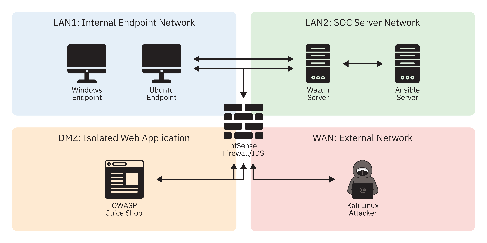
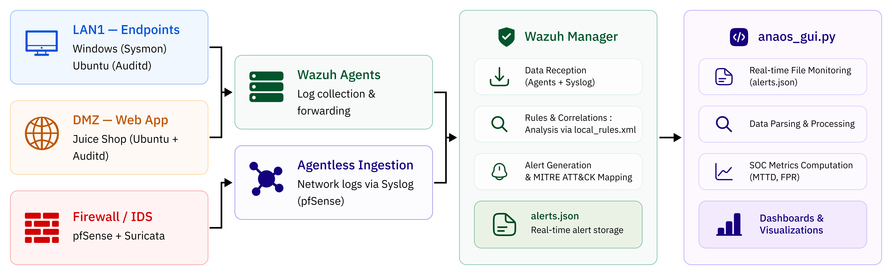

# ANAOS — Automated Network & Analysis Operations System

ANAOS is a fully automated, open-source Security Operations Centre (SOC) built on Wazuh, Suricata/pfSense, Sysmon/Auditd, and Ansible. Designed and evaluated as part of a cybersecurity research project at ENSA Khouribga (2025-2026).

Across four MITRE ATT&CK-mapped attack scenarios, the system achieved 100% detection recall, 0% false-positive rate, and deployed end-to-end in under 15 minutes via Ansible.

Full write-up: `docs/paper/ANAOS_Research_Chapter.pdf`

## Architecture

ANAOS spans four virtualised network zones — WAN, DMZ, LAN1, and LAN2 — with all inter-zone traffic inspected by pfSense/Suricata.

Telemetry from endpoints and the firewall feeds into the Wazuh Manager, which correlates events against `wazuh-rules/local_rules.xml` and writes alerts to `alerts.json`. The dashboard (`anaos_gui.py`) tails that file in real time and computes detection metrics.

## Dashboard

`anaos_gui.py` is a self-contained Python HTTP server (no external dependencies) implementing real-time alert ingestion, triage persistence, and metric computation. It exposes a single-page dashboard with live KPIs, active-agent tracking, and a sortable triage console with MITRE ATT&CK-tagged context.

## Detected Techniques

| ID | Name | Tactic |
|---|---|---|
| T1595.002 | Active Scanning | Reconnaissance |
| T1190 | Exploit Public-Facing App (SQLi) | Initial Access |
| T1110 | Brute Force | Credential Access |
| T1218.010 | Regsvr32 (Squiblydoo) | Defense Evasion |

## Limitations

The evaluation was conducted in a controlled, noise-free environment covering only four ATT&CK techniques, relies exclusively on signature/threshold-based detection, and used single-analyst triage with no inter-rater scoring. See the research chapter for a complete discussion.
