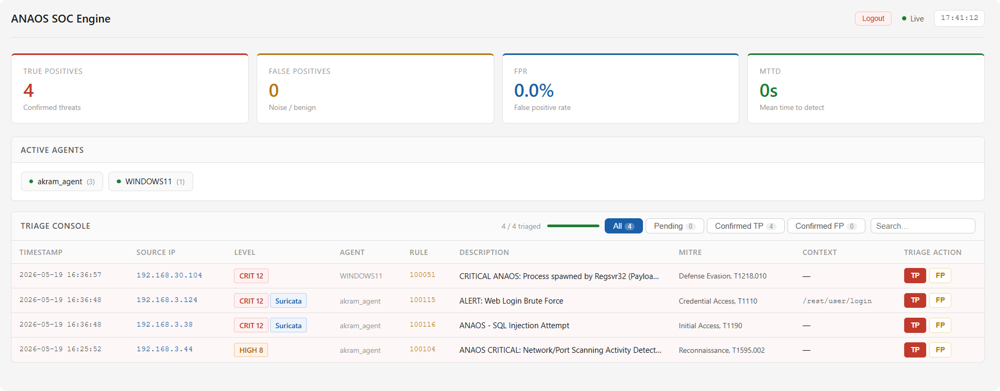

# ANAOS — Automated Network & Analysis Operations System

[](LICENSE)


ANAOS is a fully automated, open-source Security Operations Centre (SOC) built on **Wazuh**, **Suricata/pfSense**, **Sysmon/Auditd**, and **Ansible**. It was designed and evaluated as part of a cybersecurity research project at ENSA Khouribga (2025–2026).

The project demonstrates that a reproducible, infrastructure-as-code SOC can be deployed in under 15 minutes and still achieve commercial-grade detection performance — **100% recall, 0% false-positive rate** — against four MITRE ATT&CK-mapped attack scenarios.

> 📄 Full write-up: [`docs/paper/ANAOS_Research_Chapter.pdf`](docs/paper/ANAOS_Research_Chapter.pdf)

---

## ✨ Key Results

| Metric | Measured | Target | Passed |
|---|---|---|---|
| True Positives | 4 / 4 | ≥ 3 | ✅ |
| False Positives | 0 | 0 | ✅ |
| Detection Rate (Recall) | 100.0% | ≥ 80% | ✅ |
| False Positive Rate | 0.0% | ≤ 5% | ✅ |
| MTTD (network layer) | ≈ 0s | ≤ 60s | ✅ |
| ATT&CK Coverage | 100% (4/4) | ≥ 75% | ✅ |
| Deployment Time | ≈ 12 min | ≤ 15 min | ✅ |

## 🧱 Architecture

ANAOS spans four virtualised network zones — **WAN** (attacker), **DMZ** (vulnerable web app), **LAN1** (monitored endpoints), and **LAN2** (SOC servers) — with all inter-zone traffic inspected by pfSense/Suricata.


Telemetry flows from endpoints and the firewall into the Wazuh Manager, which correlates events against `local_rules.xml` and writes alerts to `alerts.json`. The custom dashboard (`anaos_gui.py`) tails that file in real time.


## 📊 Dashboard

`anaos_gui.py` is a dependency-free Python HTTP server exposing a single-page analyst dashboard: live KPIs (TP/FP count, FPR, MTTD), active-agent chips, and a sortable/filterable triage console with ATT&CK-tagged alert context.



## 🎯 Detected Techniques

| Technique ID | Name | Tactic | Data Source |
|---|---|---|---|
| T1595.002 | Active Scanning | Reconnaissance | Suricata / Web |
| T1190 | Exploit Public-Facing App (SQLi) | Initial Access | Suricata / HTTP |
| T1110 | Brute Force | Credential Access | Suricata / HTTP |
| T1218.010 | Regsvr32 (Squiblydoo) | Defense Evasion | Sysmon EID 1 |

## 📂 Repository Layout

```
anaos/
├── anaos_gui.py                # Analyst dashboard / alert triage server
├── wazuh-rules/
│   └── local_rules.xml         # Custom ATT&CK-mapped Wazuh detection rules
├── ansible/
│   ├── inventory.example.ini   # Sample inventory (copy -> inventory.ini)
│   └── playbooks/
│       ├── deploy_wazuh_agent_linux.yml
│       ├── deploy_windows_endpoint.yml
│       └── configure_auditd.yml
├── docs/
│   ├── images/                 # Architecture & dashboard screenshots
│   └── paper/                  # Full research chapter (PDF)
└── README.md
```

## 🚀 Getting Started

### Prerequisites
- A Wazuh Manager (v4.9+) already installed on your SOC server (LAN2)
- Ansible control node with access to target endpoints (WinRM for Windows, SSH for Linux)
- pfSense + Suricata configured to forward EVE-JSON alerts via syslog to the Wazuh Manager

### 1. Deploy the rule set
Copy `wazuh-rules/local_rules.xml` to `/var/ossec/etc/rules/local_rules.xml` on the Wazuh Manager and restart the manager service:
```bash
sudo cp wazuh-rules/local_rules.xml /var/ossec/etc/rules/local_rules.xml
sudo systemctl restart wazuh-manager
```

### 2. Provision endpoints with Ansible
```bash
cd ansible
cp inventory.example.ini inventory.ini   # fill in real hosts/creds — gitignored
ansible-playbook -i inventory.ini playbooks/deploy_wazuh_agent_linux.yml
ansible-playbook -i inventory.ini playbooks/deploy_windows_endpoint.yml
ansible-playbook -i inventory.ini playbooks/configure_auditd.yml
```

### 3. Run the dashboard
On the Wazuh Manager host (where `alerts.json` lives):
```bash
python3 anaos_gui.py
```
Edit the `CONFIG` dict at the top of `anaos_gui.py` to set `dashboard_ip`, `port`, and `log_file` path for your environment. Then open `http://<dashboard_ip>:8080/`.

## ⚠️ Limitations

- Evaluated in a noise-free lab; real traffic would likely raise FPR (esp. the brute-force threshold rule).
- Only 4 of ~600+ ATT&CK techniques are covered — no lateral movement, persistence, C2, or exfiltration detection yet.
- Signature/threshold-based only; no behavioural anomaly detection.
- Single-analyst triage; no inter-rater reliability scoring on FP/TP verdicts.
- MTTD uses "first packet from source IP" as attack-onset proxy, which can underestimate true onset for multi-vector intrusions.

See the full **Discussion & Limitations** section in the [research chapter](docs/paper/ANAOS_Research_Chapter.pdf) for details.

## 🔭 Future Work
- Expand rule coverage to 20+ ATT&CK techniques (post-exploitation: T1055, T1003, T1059, T1083)
- SOAR integration — auto-block confirmed TPs via pfSense
- Behavioural/ML-based anomaly detection layer

## 👥 Authors

Ismail Bajjou · Ousmane Issa Adam · Othmane Nechchadi · Yassine Sarih · Akram Zerbane
Supervised by **Dr. Yassine Maleh** — ENSA Khouribga, 2025–2026

## 📜 License

This project is released under the [MIT License](LICENSE).
